# Tugas CRUD KTP - Dara Syauqi Darmawan - 20230140140
# Screenshot API Testing (Postman)

### POST Data KTP

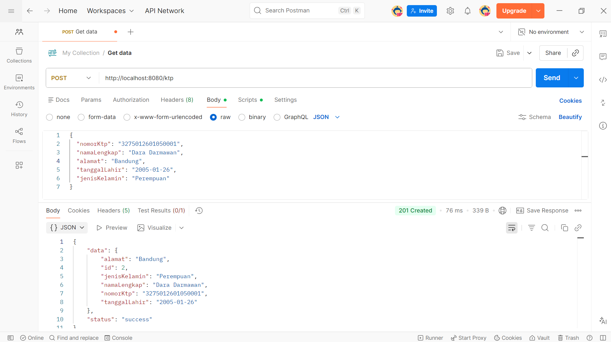

### GET Semua Data

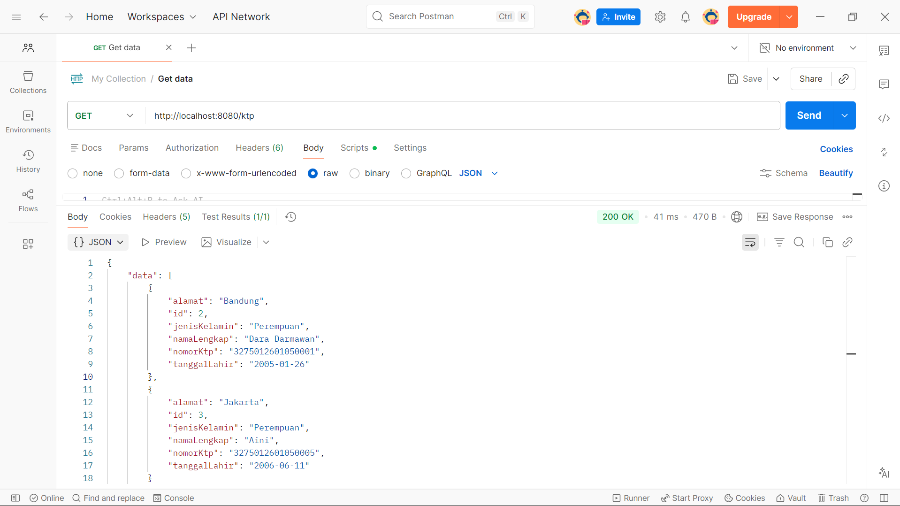

### GET Data Berdasarkan ID

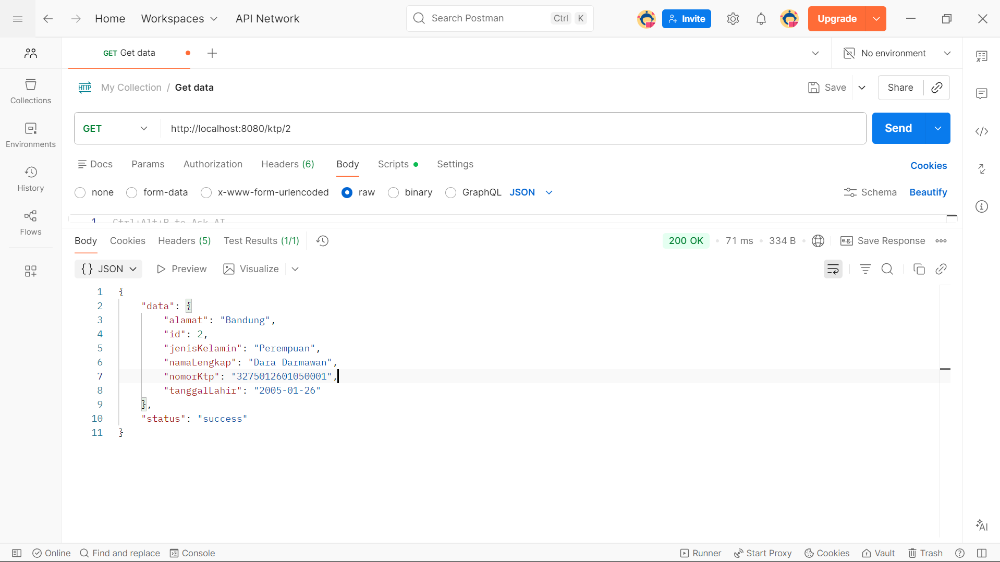

### UPDATE Data

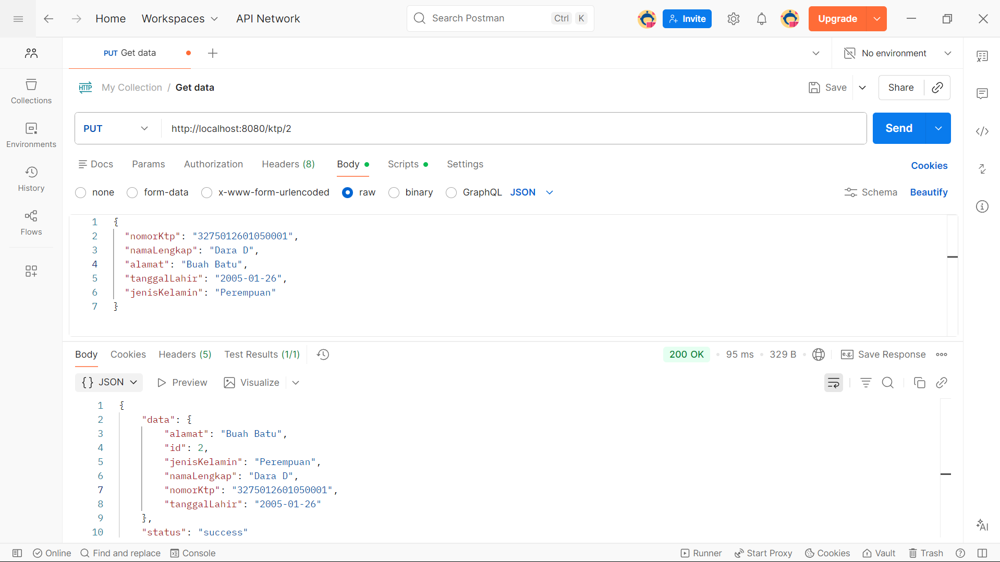

### DELETE Data

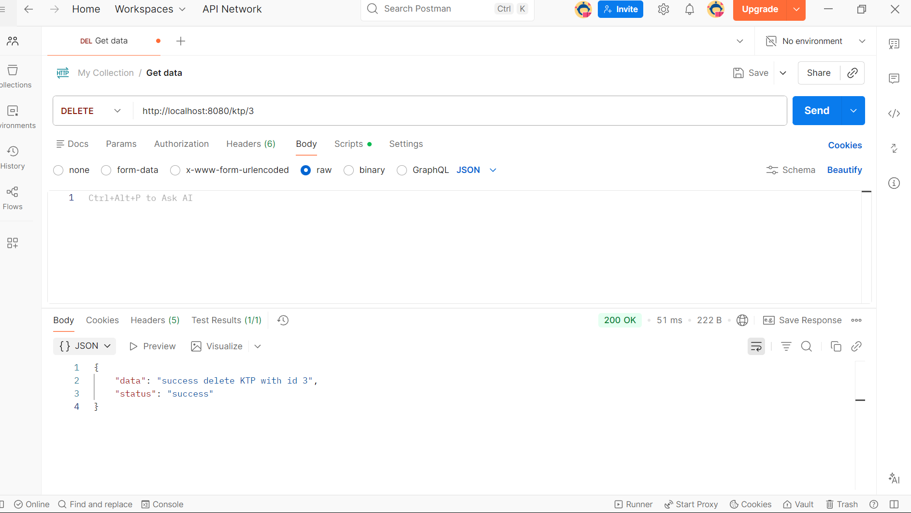

---

# Tampilan Website

### Setelah Tambah Data

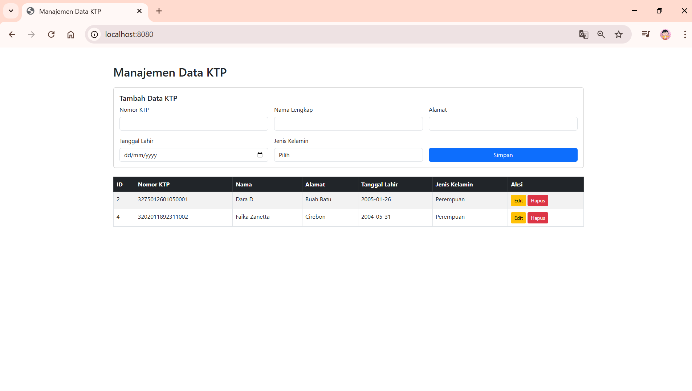

### Update Data

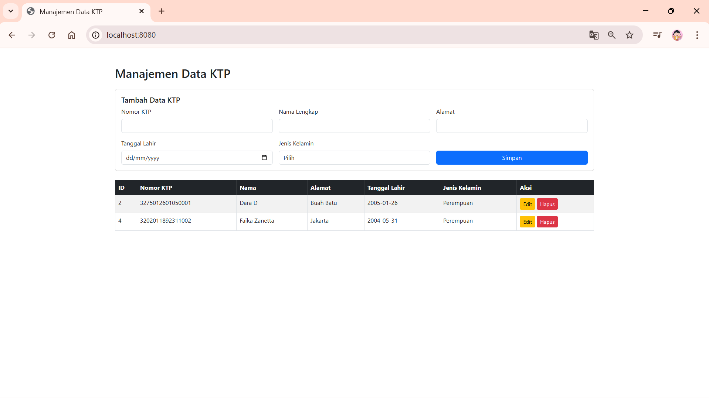

---

# Notifikasi Sistem

### Notifikasi Berhasil Menambahkan Data

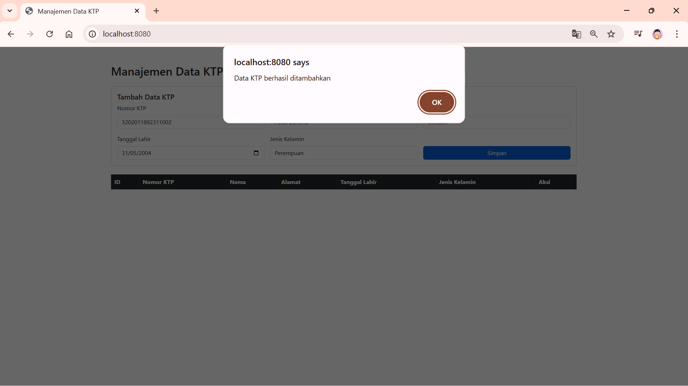

### Notifikasi Berhasil Update Data

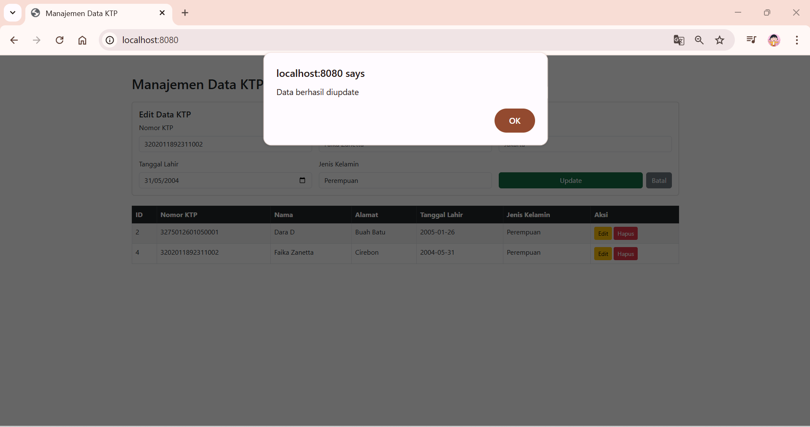

### Konfirmasi Delete

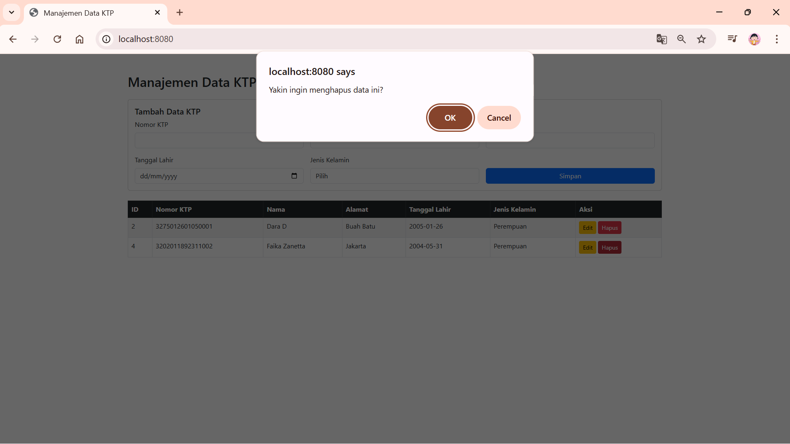

### Notifikasi Berhasil Delete Data

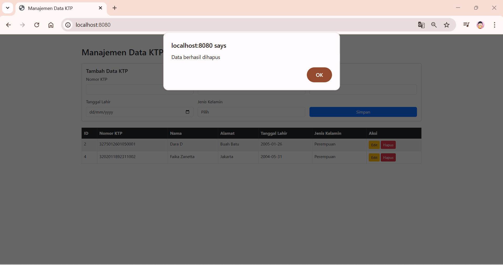

---

### Database 
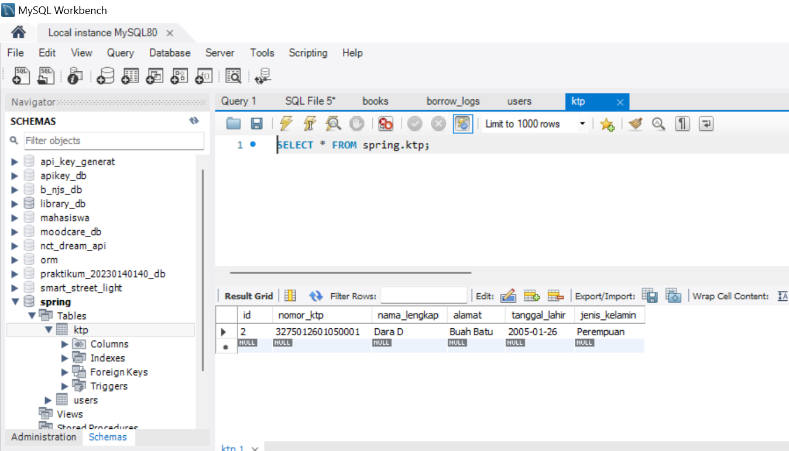

